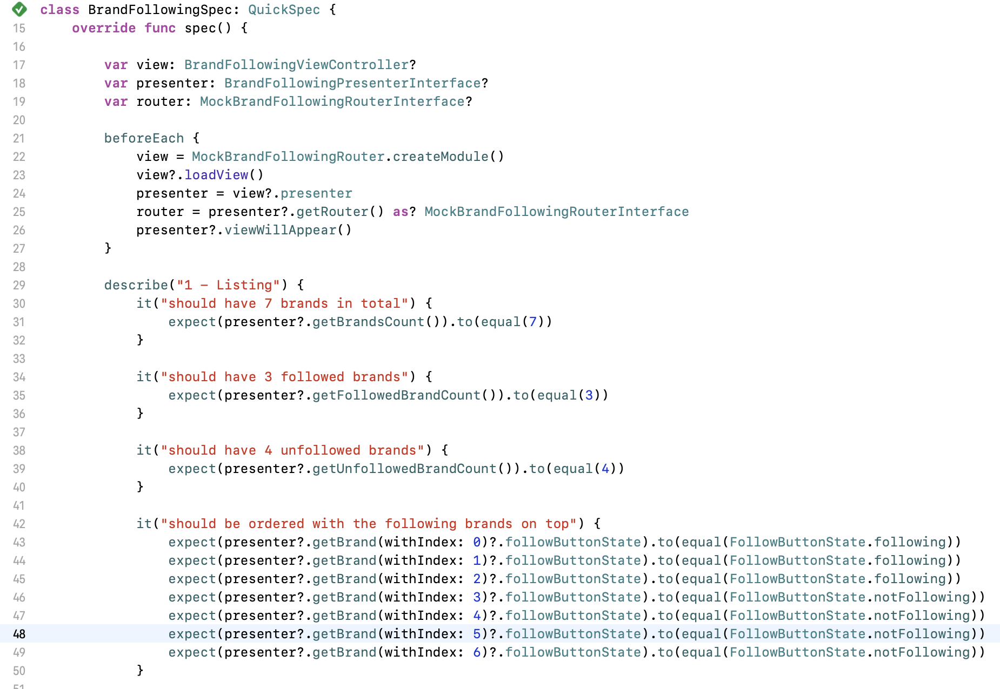
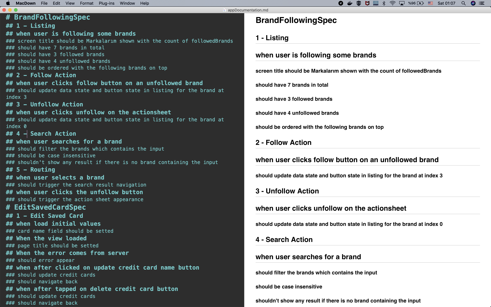

# doq

doq is a script that converts your Quick tests to readable documentations.

## doq converts this

## to this

## License

MIT License, Copyright (c) 2018 Efekan Egeli, [@efekanegeli](https://twitter.com/efekanegeli)
